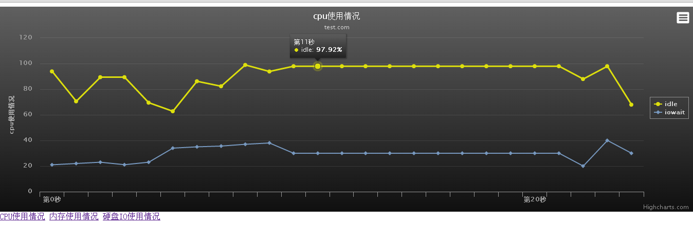
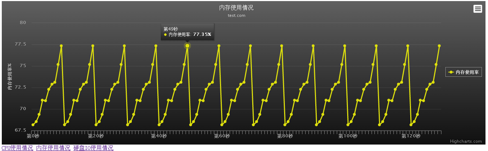
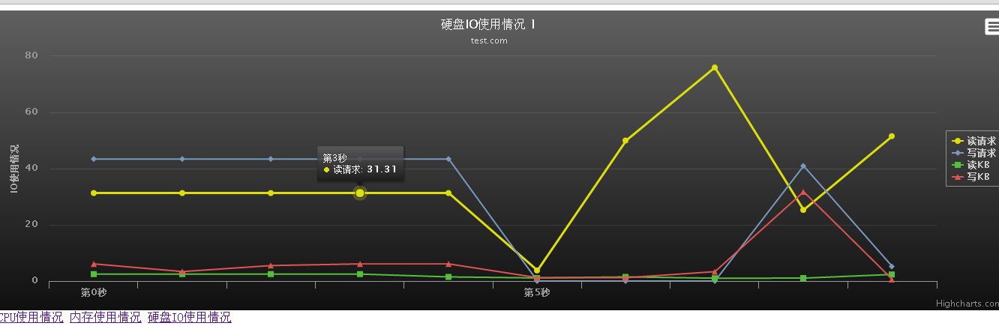

基于js hcharts分析 服务器中sar 的日志：

参考官网：http://www.hcharts.cn/


cpu,内存，硬盘io信息，删掉了第1-3行和最后一行，这样有利于js分析

shell 脚本如下：

``` shell 
#!/bin/bash
if (( $# != 1))
then
    echo "please input sum time:"
    exit 1
fi
sar -u 1 $1 | sed '1,3d'|sed '$d' > sar_cpu_1.txt
sar -r 1 $1 |sed '1,3d'|sed '$d' > sar_men_1.txt
sar -b 1 $1 |sed '1,3d'|sed '$d' > sar_io_1.txt
```








sar参数说明：

http://github.com/284772894/sar_Highcharts/raw/master/txt/sar.txt)